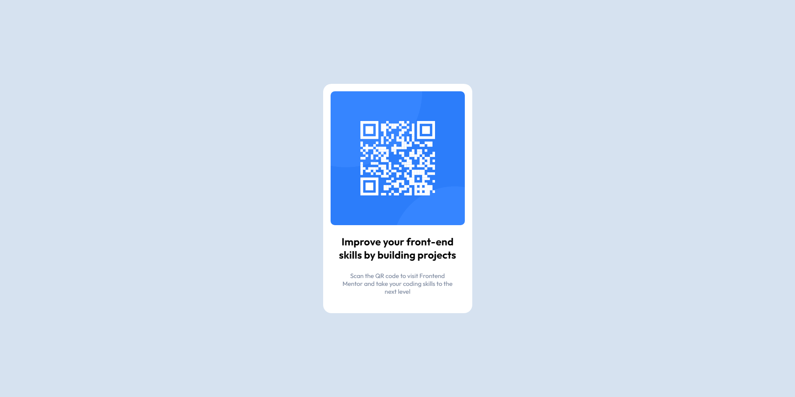

# Frontend Mentor - QR code component solution

This is a solution to the [QR code component challenge on Frontend Mentor](https://www.frontendmentor.io/challenges/qr-code-component-iux_sIO_H). Frontend Mentor challenges help you improve your coding skills by building realistic projects. 

## Table of contents

- [Overview](#overview)
  - [Screenshot](#screenshot)
  - [Links](#links)
- [My process](#my-process)
  - [Built with](#built-with)
  - [What I learned](#what-i-learned)
  - [Continued development](#continued-development)
- [Author](#author)

**Note: Delete this note and update the table of contents based on what sections you keep.**

## Overview

### Screenshot

### Links

- Solution URL: [GitHub](#)
- Live Site URL: [Add live site URL here](https://doggokt.github.io/frontendmentor/1-qrcode)

## My process

### Built with

- HTML5
- CSS with the help of [SASS](https://sass-lang.com/)

### What I learned

-- Googles for the 3249th time: how to center a div --

### Continued development

Make myself a generator, possibly a link per QR and use this neat design as an output :)

## Author

- Website - [Doggo](https://github.com/Doggokt)
- Frontend Mentor - [@DoggoKt](https://www.frontendmentor.io/profile/DoggoKt)
- Discord - `Doggo#1185`
